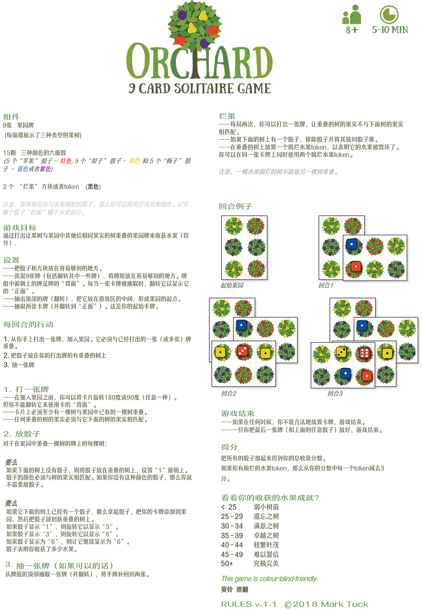

# Orchard

2018年最佳PNP桌游的web版本。(WIP)

## 游戏规则



## 使用

```shell
# 安装
pnpm install
# 启动
pnpm run dev
```

## 功能说明

### 控制按键

- （在游戏桌）按住`右键`并移动：移动游戏桌
- （选择牌后）`空格`：顺时针旋转90°

### 待完善

目前已经基本可以完成一局游戏，但仍有功能有待完善：

- UI优化
  - 主界面优化
  - 分数骰子
  - 弹窗提示
  - 结束界面分数展示
- 结束后重新开始按钮
- 过渡动画
- 内置说明文档
- 在不能合法地放置卡牌时结束游戏
