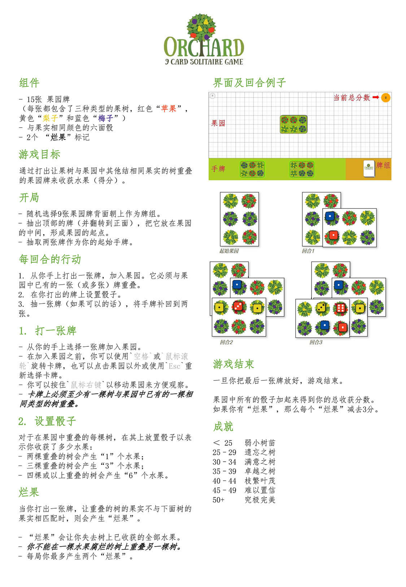

# Orchard

基于 Mark Tuck 设计的“果园（orchard）”`2018年最佳PNP桌游`开发的web游戏。

试玩：[http://game.wingsnow.cn/orchard-9pnp/](http://game.wingsnow.cn/orchard-9pnp/)

## 游戏规则



> 感谢 葵铃 提供的原始游戏规则翻译

## 使用

```shell
# 安装
pnpm install
# 启动
pnpm run dev
# 构建
pnpm run build
# 预览
pnpm run preview
```

## 功能说明

### 操作

- （在游戏桌）按住`右键`并移动：移动游戏桌
- （选择牌后）`鼠标滚轮`或`空格`：顺时针旋转90°
- （选择牌后）`点击游戏桌外`或`Esc`：取消选牌

### 待完善

以下优化项在计划中：

- 结束界面成就展示美化
- 在不能合法地放置卡牌时结束游戏
